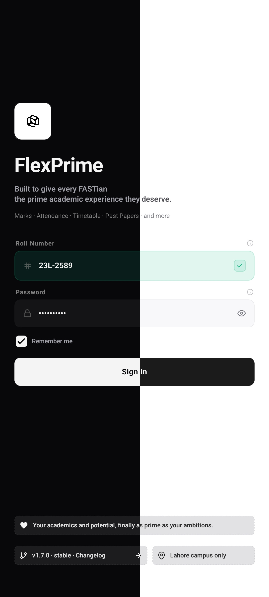
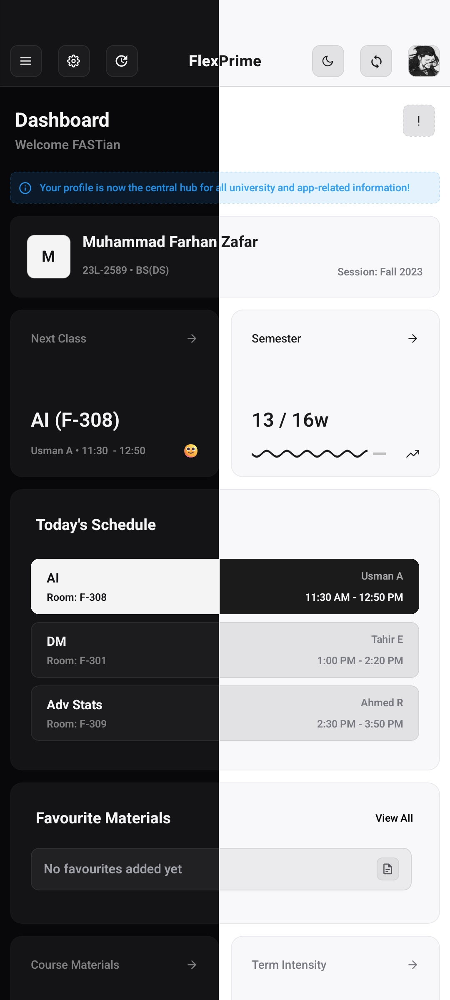
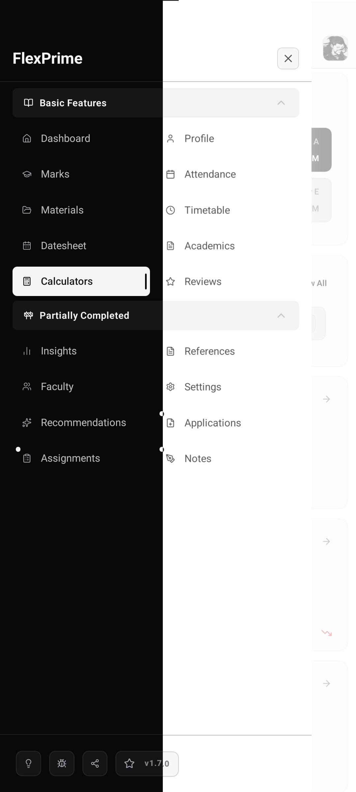
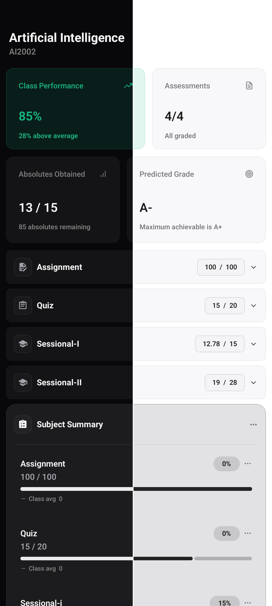
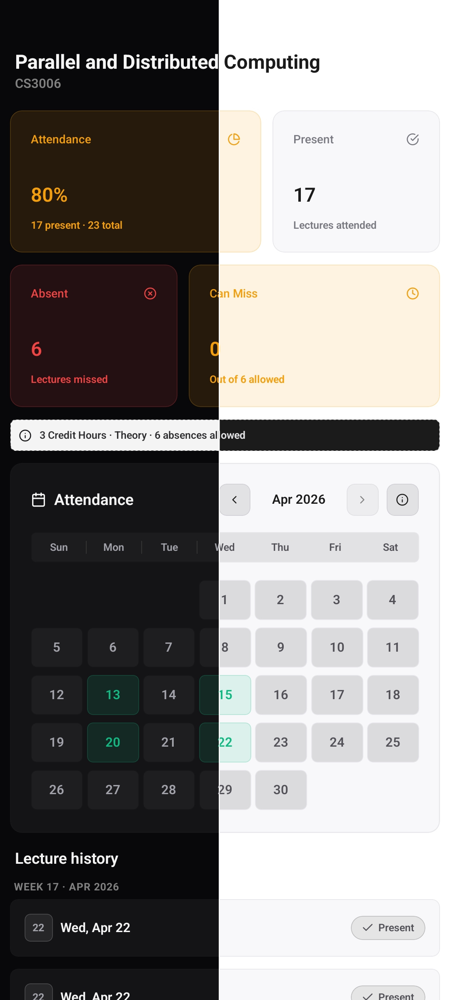
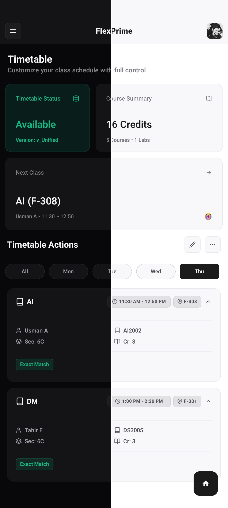
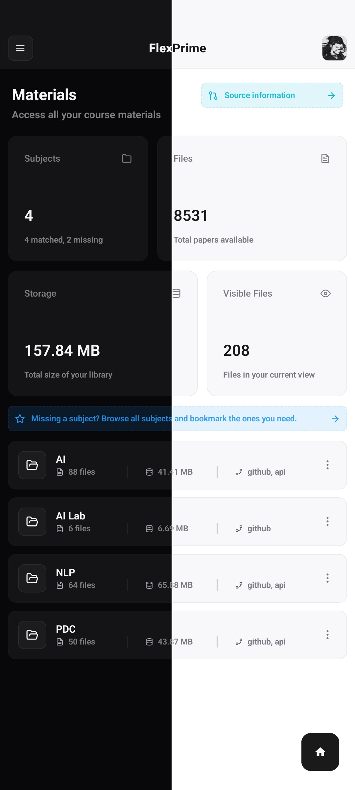
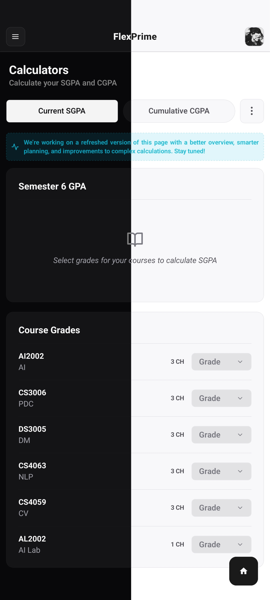

# FlexPrime — Academic Companion for FASTians

> **Built to give every FASTian the prime academic experience they deserve.**
> Marks · Attendance · Timetable · Past Papers · and more — faster, smarter, and more useful than the official portal.

---
## Screenshots

  
  
  
  
  
  
  
  

---

## Why FlexPrime?

The official Flex portal works — but barely. No analytics, no insights, no way to track 
your progress meaningfully. FlexPrime was built out of frustration with that experience 
and a belief that students deserve better tools.

Everything the portal does, FlexPrime does faster. Everything it doesn't do — analytics, 
insights, materials, reviews, productivity tools — FlexPrime does that too.

## Features

### Marks & Analytics
- Semester-wise marks breakdown with weighted averages and predicted grades
- Live diff-checking — get notified the moment new marks are posted
- Class average comparisons and performance tracking
- Approximated SGPA/CGPA the official portal doesn't provide

### Attendance
- Real-time percentages with color-coded risk indicators
- "Classes to Bunk" and "Classes Needed" calculators per subject
- Subject-wise present/absent/leave breakdown

### Timetable
- Clean calendar and list views with venue and instructor details
- Export as image or PDF

### Datesheet & Exams
- Full exam schedule with date, time and venue
- Export as image or PDF for offline reference

### Materials Hub
- Past papers, outlines, notes and more — aggregated from multiple trusted sources
- Smart categorization by course, type and semester
- Bookmarking, search and direct download

### Teacher Reviews
- Ratings and feedback from previous students
- Powered by NucesRate via custom search and extraction

### Study Plan & Transcript
- Semester-wise course progression with credit hour tracking
- Degree completion progress and prerequisite chains
- Complete academic history beautifully presented

### Productivity
- Applications generator for structured leave/extension applications
- Assignments tracker for managing deadlines and task types
- GPA calculators for SGPA and CGPA planning
- Faculty directory with profiles, qualifications and contact info (Lahore campus)

### Customization
- Dark mode with custom accent colors
- Font scaling, border radius and spacing controls
- Concise UI mode for information-dense layouts

---

## Installation

1. Download the latest APK from the [Releases Page](https://github.com/FarhanZafarr-9/FlexPrime/releases/latest)
2. Enable **Install from Unknown Sources** if prompted
3. Install and launch — sign in with your university credentials
4. Your data syncs automatically on first login

---

## Known Limitations

- App may crash on first launch due to initial setup/update checks — relaunching 2–3 times usually resolves it
- Study plan data may occasionally fail to load — re-login or logout and back in for a clean refresh
- Attendance may also fail to load or keep failing across refreshes — similar workaround as above
- App is currently built for FAST-NUCES Lahore campus only

---

## Tech Stack

React Native · Expo · Supabase · React Navigation · AsyncStorage · Day.js

---

## Data Sources

- Materials: [Academic Time Machine](https://github.com/saleha-muzammil/Academic-Time-Machine), [CampusPlus](https://www.campusplus.live/past-papers)
- Reviews: [NucesRate](https://nucesrate.vercel.app/)
- All data fetched ethically within respective site policies

---

## Disclaimer

FlexPrime is an independent student project and is **not officially affiliated with, endorsed by, or connected to FAST-NUCES** or its official Flex Student Portal. All data is sourced from official university portals and public resources. Always verify critical information through official university channels.

---

## Contact & Support

- Email: flexprime.dev@gmail.com
- Bug reports: [GitHub Issues](https://github.com/FarhanZafarr-9/FlexPrime/issues)
- In-app feedback available from the app menu

---

## About

Made with ❤️ by Parzival — a solo passion project built late nights between classes and exams, started August 2025. If FlexPrime helped you, share it with a classmate.

